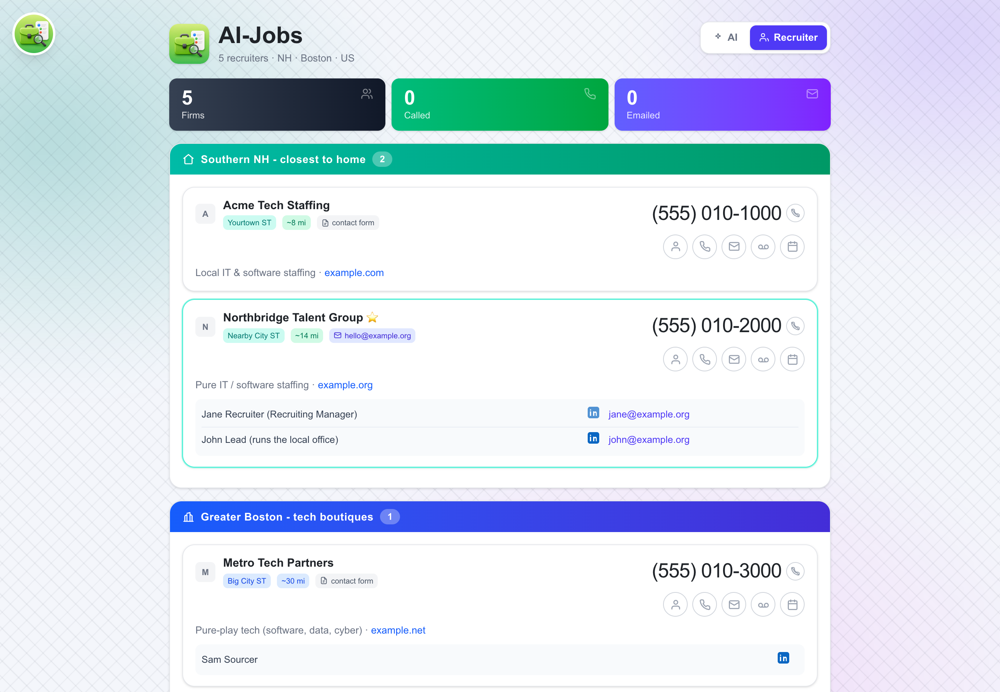
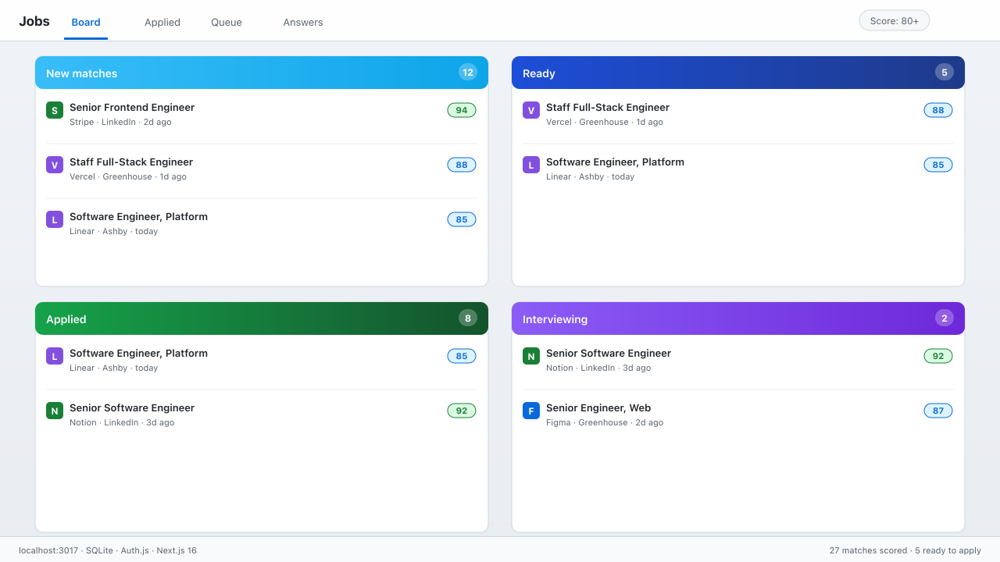
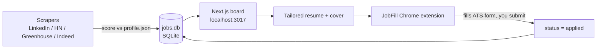

<div align="center">


# AI-Jobs

**A DIY job-hunt engine that runs entirely on your machine.**
Scrape jobs, score them against your profile, tailor a resume + cover, and autofill the
application - all local, all private, zero data sent to a third party.

[](https://github.com/bunlongheng/ai-jobs/actions/workflows/ci.yml)
[](LICENSE)


[](https://github.com/bunlongheng/ai-jobs/issues)



</div>

## Contents

- [Why AI-Jobs](#why-ai-jobs)
- [Features](#features)
- [Screenshots](#screenshots)
- [How to use it](#how-to-use-it)
- [How to configure](#how-to-configure)
- [How to deploy](#how-to-deploy)
- [How to debug](#how-to-debug)
- [Drive it with an AI agent](#drive-it-with-an-ai-agent)
- [Contributing and support](#contributing-and-support)
- [Architecture](#architecture)
- [License](#license)

## Why AI-Jobs

Job hunting means 12 open tabs, a spreadsheet, and re-typing the same answers into every ATS.
AI-Jobs collapses that into one local board:

- **One place for the whole hunt** - every match, its score, status, and your notes.
- **Scored to your profile** - a 0-100 rubric (title, stack, comp, remote, domain) auto-ranks
  postings so you only look at the ones worth applying to.
- **Less busywork** - the browser extension autofills ATS forms from your saved answers; you
  review and submit. Tailored resume + cover per job.
- **Private by default** - all personal data is gitignored and stays local; the app is
  localhost-only unless you deliberately expose it, gated to one Google account.
- **Yours to automate** - plain Node scripts + a SQLite file + an HTTP API, so you can drive
  the whole flow with your own AI coding agent.

## Features

- 🔎 **Multi-source scraping** - LinkedIn (guest API), Hacker News "Who is hiring", Greenhouse,
  and Indeed (Playwright), all anonymous.
- 🎯 **0-100 scoring** - every posting ranked against your `profile.json` rubric; only matches
  (score >= 50) are inserted.
- 🗂️ **Pipeline board** - `planned -> kit_ready -> applied`, grouped by status with score tiers,
  sparklines, search, and an Archived pile for rejected/disliked.
- ✍️ **Tailored kits** - a staff-level resume + cover per job, rendered to a real PDF.
- 🧩 **JobFill Chrome extension** - fills any ATS form from your answers; you always submit by hand.
- ☎️ **Recruiter call sheet** - track called/emailed/voicemail per firm, who you spoke to, the
  next meeting, and dead phone numbers.
- 🔒 **Private + self-hosted** - one SQLite file, localhost-only, single-account Google gate.
- 🤖 **Agent-friendly** - an [`AGENTS.md`](AGENTS.md) so your own AI agent can run the whole loop.

## Screenshots

| Pipeline board | Recruiter call sheet |
|:--:|:--:|
|  |  |

## How to use it

Requirements: **Node 20+** and **Chrome** (for the extension). No database to install - it is a
single SQLite file created on first run.

### 1. Install and bootstrap

```bash
git clone https://github.com/bunlongheng/ai-jobs.git
cd ai-jobs
npm install                 # root deps (Playwright, used by the Indeed scraper)
npm run setup               # copies *.example -> your real files (idempotent, never overwrites)
```

`npm run setup` creates these gitignored files from committed templates (fill them in - see
[How to configure](#how-to-configure)): `web/.env.local`, `profile.json`,
`web/data/recruiters.json`, and `web/public/me.png`.

### 2. Run the app

```bash
cd web
npm install
npm run dev                 # http://localhost:3017/jobs  (localhost bypasses login)
```

`web/jobs.db` is created automatically on first run.

### 3. Load the Chrome extension (JobFill)

1. Open `chrome://extensions`, turn on **Developer mode** (top right).
2. Click **Load unpacked** and select `web/extension/`.
3. With the app running, open a job's apply page - the extension fills the ATS form from your
   `profile.json` answers. Review, then submit by hand.

### 4. The everyday loop

1. **Find jobs** - run a scraper to pull + score matches into the board:
   ```bash
   node scrape_linkedin.mjs     # LinkedIn guest API (no login, no browser)
   node hn_search.mjs           # Hacker News "Who is hiring"
   node greenhouse_search.mjs   # public Greenhouse boards
   node scrape_indeed.mjs       # Indeed (Playwright; may hit a Cloudflare wall)
   ```
2. **Review** the board at `http://localhost:3017/jobs` (grouped by status, defaults to 80+).
3. **Tailor** a resume + cover for a job you like, and pre-run the form to "Ready".
4. **Apply** - open the apply page, let JobFill fill it, review, submit. It flips to `applied`.
5. **Recruiters** - `http://localhost:3017/jobs/recruiters` is a call sheet: track outreach,
   next meetings, and dead numbers. Click a firm to spotlight it and pop up your call script.

## How to configure

Everything personal lives in gitignored files created by `npm run setup`:

| File | What it controls |
|------|------------------|
| `profile.json` | Identity, targets (titles, comp floor, remote), apply answers (EEO, work auth), the 0-100 scoring rubric, and your phone `pitch`. The scrapers and board read it - single source of truth. |
| `web/.env.local` | Auth + integrations (see below). |
| `web/data/recruiters.json` | Your recruiter call sheet (`nh` / `boutique` / `national` / `us`). Sample committed as `recruiters.example.json`. |
| `web/public/me.png` | Your photo on the call-script card (a neutral placeholder is seeded). |

`web/.env.local` keys (copy from `web/.env.example`):

```ini
ADMIN_EMAIL=you@example.com        # the ONLY Google account allowed in (fail-closed if unset)
GOOGLE_CLIENT_ID=...               # Google OAuth "Web application" client
GOOGLE_CLIENT_SECRET=...           # redirect URI: http://localhost:3017/api/auth/callback/google
AUTH_SECRET=...                    # openssl rand -base64 32
AUTH_URL=http://localhost:3017     # base URL the app serves from
JOBS_DB=                           # optional; defaults to web/jobs.db
HUNTER_API_KEY=                    # optional: recruiter email finder (hunter.io)
GMAIL_REFRESH_TOKEN=               # optional: HN auto-email-apply + rejection sweep
```

Tuning the rubric, salary floor, target titles, and excluded companies is all done in
`profile.json` - no code changes needed.

## How to deploy

**Self-hosted only** - SQLite cannot persist on serverless, so do not deploy to Vercel.

- **Local production:** `cd web && npm run build && npm run start` (serves on `127.0.0.1:3017`).
- **Phone / tablet access:** expose it over a private tunnel gated to your Google account - a
  `tailscale serve` URL works well. Set `AUTH_URL` to that URL and register the OAuth redirect.
  Localhost stays login-free; remote requires sign-in.
- **Unattended (macOS):** copy a `*.plist.example` launchd template, replace `__HOME__` /
  `__NODE_BIN__`, and `launchctl load` it to keep the app up and run scrapers on a schedule.

## How to debug

| Symptom | Fix |
|---------|-----|
| `no such table: applications` when running a scraper | Fixed - scrapers now create the schema. If you see it on an old checkout, start the app once (`npm run dev`) to initialize `jobs.db`. |
| `npm install` warns "install scripts not covered" | A machine-level npm allow-scripts policy. better-sqlite3 ships prebuilt binaries in `node_modules/better-sqlite3/prebuilds/` and needs no build; if it still fails, `npm rebuild better-sqlite3`. |
| Indeed scraper returns nothing / "Cloudflare wall" | Expected - retry with `node scrape_indeed.mjs --headful`, or rely on LinkedIn / HN / Greenhouse. |
| Can't sign in remotely | `ADMIN_EMAIL` must match your Google account exactly; `AUTH_URL` must match the URL you visit; the OAuth redirect URI must be registered. |
| Port 3017 in use | Change the port in `web/package.json` scripts. |
| Board is empty | Run a scraper - the board only shows what is in `jobs.db`. |

Logs: scrapers print a ranked summary to stdout. The whole database is one file (`web/jobs.db`) -
open it with any SQLite browser to inspect state.

## Drive it with an AI agent

No hidden state - just Node scripts, a SQLite file, and an HTTP API. Point your coding agent
(Claude Code, Cursor, etc.) at the repo:

- It reads **[`AGENTS.md`](AGENTS.md)** - the operational map: commands, the `applications` table,
  the JobFill API, and the guardrails.
- Example prompts: *"Run the scrapers and show me new 80+ matches"*, *"For job `<id>` write a
  tailored resume + cover and pre-run the form"*, *"Mark job `<id>` as applied"*.
- **Guardrail:** never let an agent auto-submit an ATS form. Applying is always your final click.

## Contributing and support

- **Bug or idea?** Open an issue: https://github.com/bunlongheng/ai-jobs/issues
- **Contribute?** Fork, branch, and open a PR. Keep changes focused; run `npm run test` (in `web/`)
  before submitting.
- **Stuck?** File an issue with what you ran and the output - fastest way to get help. You can also
  reach the author via GitHub: https://github.com/bunlongheng

## Architecture



```
ai-jobs/
  web/                       # Next.js 16 app (port 3017), reads/writes web/jobs.db
    app/jobs/                #   board + detail + recruiters
    app/api/*                #   board actions + the JobFill extension API
    lib/db.ts, lib/schema.sql#   SQLite connection + shared schema
    extension/               #   Chrome MV3 "JobFill"
  scrape_*.mjs, hn_search.mjs, greenhouse_search.mjs   # scrapers
  scoring.mjs                # shared 0-100 scorer + dedupe + insert
  profile.json               # single source of truth (gitignored)
  AGENTS.md                  # operational guide for AI agents
```

Statuses: `planned` (new) -> `kit_ready` (tailored + pre-run) -> `applied`, plus `manual_only`,
`rejected`, `liked` (`1`/`-1`/`0`), and `score` (0-100). `web/jobs.db`, `web/.env.local`,
`profile.json`, and `web/data/recruiters.json` are gitignored - the repo ships the engine, never data.

## License

[MIT](LICENSE) (c) Bunlong Heng
