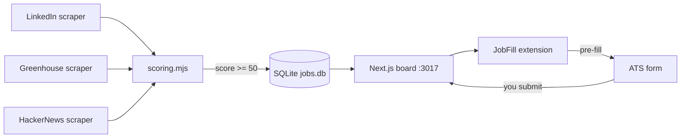

# ai-jobs

A self-hosted, single-user job-hunt engine that runs entirely on your Mac - scrapers pull jobs from LinkedIn, Greenhouse, Lever, Ashby, and HackerNews, score each 0-100 against your profile, and land them in a local SQLite board where you tailor a resume and cover, then a Chrome extension pre-fills the ATS form.


[](LICENSE)


## Contents

- [Features](#features)
- [Architecture](#architecture)
- [How it works](#how-it-works)
- [Tech stack](#tech-stack)
- [Quick start](#quick-start)
- [Configuration](#configuration)
- [Project layout](#project-layout)
- [License](#license)

## Features

- Scrapes LinkedIn (guest API), Greenhouse, Lever, Ashby, and HackerNews "Who's Hiring" without login
- Scores every job 0-100 against a profile rubric (seniority, stack, remote/comp fit, domain, company quality)
- Deduplicates across runs - same job never appears twice
- Board groups jobs by status (New, Ready, Applied, Interviewing, Archived) with score-based filter (80+ default)
- Chrome MV3 extension (JobFill) pre-fills any ATS form; you review and submit by hand
- Auth.js/Google gate - localhost is open, Tailscale/LAN requires sign-in
- Vitest unit tests + Playwright e2e smoke tests
- Nightly DB backup script with 14-snapshot retention via iCloud/Dropbox

## Architecture

Scrapers run as Node `.mjs` scripts triggered by launchd, scoring against `profile.json`. Matches land in a SQLite database that the Next.js board reads directly via `better-sqlite3`. The JobFill Chrome extension polls the board's API and fills the ATS form automatically, leaving the final submit to you.



| Layer | Role |
|---|---|
| `scoring.mjs` | Shared scorer + deduper + SQLite inserter |
| `web/` | Next.js 16 App Router board + API routes |
| `web/extension/` | Chrome MV3 JobFill extension |
| `*.mjs` scrapers | Per-source job fetchers (LinkedIn, Greenhouse, HN, Ashby) |
| `launchd` | Schedule scrapers + app at boot |

## How it works

```
scrape_linkedin.mjs (launchd, nightly)
  -> scoring.mjs scores vs profile.json, dedupes, inserts score >= 50
  -> open the board at localhost:3017
  -> /job-prep tailors resume + cover, pre-runs the form, flips status to Ready
  -> JobFill extension fills the ATS form
  -> you submit; extension POSTs 'submitted' -> status = applied
```

## Tech stack

- Next.js 16 (App Router) - server components, no client state for the board
- React 19 + TypeScript 5 + Tailwind 4
- SQLite via `better-sqlite3` - single-file persistence, no separate DB server
- Auth.js v5 with Google OAuth - JWT sessions, no DB adapter needed
- Node `.mjs` scrapers - Playwright for Indeed, guest APIs for LinkedIn/Greenhouse
- Chrome MV3 extension - content script + background service worker + popup
- Vitest for unit tests, Playwright for e2e smoke
- launchd (macOS) for scheduling - see `*.plist.example` files

## Quick start

```bash
git clone https://github.com/bunlongheng/ai-jobs.git
cd ai-jobs/web
npm install
cp ../.env.example .env.local   # fill in your values
npm run dev                      # http://localhost:3017
```

Scrape your first jobs:

```bash
cd ..
node scrape_linkedin.mjs        # LinkedIn guest API (no login needed)
node hn_search.mjs              # HackerNews "Who's Hiring" (monthly thread)
```

## Configuration

Copy `.env.example` to `web/.env.local` and set:

| Env var | Default | Purpose |
|---|---|---|
| `ADMIN_EMAIL` | required | Google account that can sign in |
| `GOOGLE_CLIENT_ID` | required | Google OAuth client ID |
| `GOOGLE_CLIENT_SECRET` | required | Google OAuth client secret |
| `AUTH_SECRET` | required | Auth.js session secret (any random string) |
| `AUTH_URL` | required | Your public URL (Tailscale host or localhost) |
| `JOBS_DB` | `./jobs.db` | Path to the SQLite file |

For local-only use, `localhost:3017` bypasses Google auth entirely - no `ADMIN_EMAIL` needed.

## Project layout

```
ai-jobs/
  scoring.mjs             # shared scorer + deduper + SQLite inserter
  scrape_linkedin.mjs     # LinkedIn guest-API scraper (no login)
  scrape_indeed.mjs       # Indeed scraper via Playwright (anonymous)
  hn_search.mjs           # HackerNews "Who's Hiring" via Algolia API
  greenhouse_search.mjs   # 31 public Greenhouse boards
  linkedin_search.sh      # launchd wrapper for nightly LinkedIn + HN + Greenhouse run
  backup_db.sh            # nightly SQLite snapshot (14-day retention)
  *.plist.example         # launchd service templates (copy + edit paths)
  web/
    app/jobs/             # board UI (server components + small client islands)
    app/api/jobfill/      # Chrome extension API (event, command queue, kit, rules)
    lib/db.ts             # SQLite schema + connection + light migrations
    lib/queries.ts        # getBoard / getApp - all reads, panel grouping, score filter
    auth.ts               # Auth.js Google gate (single email)
    middleware.ts         # route protection
    extension/            # Chrome MV3 JobFill - fills any ATS form, submit beacon
  docs/screenshots/       # README images
```

## License

[MIT](LICENSE) (c) Bunlong Heng
