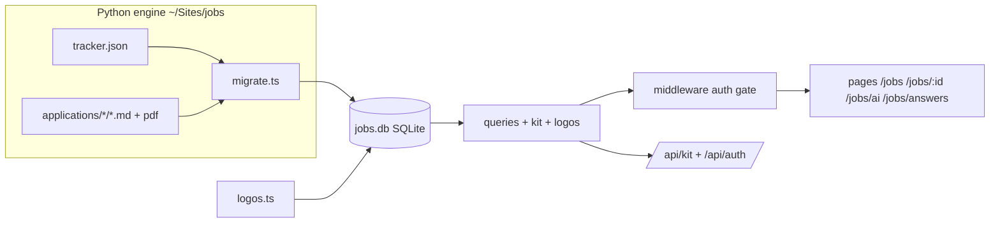

# Jobs

Local job-hunt pipeline - Next.js 16 + TypeScript + SQLite. Auth-gated board at
`/jobs` with per-application drill-downs. Self-contained: all data (applications,
events, tailored resume/cover/screening markdown, resume PDFs, cached company
logos) lives in `jobs.db` (gitignored - it holds personal data).

## Architecture

## Run
- Copy `.env.example` -> `.env.local`; set `JOBS_SECRET` + `JOBS_PASSWORD`.
- `npm run migrate` - import engine data (incl. kit markdown + PDFs) into `jobs.db`
- `npm run logos` - cache company favicons as data URIs (fetched once)
- `npm run dev` - http://localhost:3017/jobs (bound to 127.0.0.1)
- `npm test` - vitest (auth, queries, kit sanitize, logos)
- `npm run test:e2e` - Playwright smoke (login -> board -> drill-down)
- `npm run build && npm start` - production

## Auth
Every route is gated by `middleware.ts` - unauthenticated pages redirect to
`/login`, API requests get 401. Login checks `JOBS_PASSWORD` (rate-limited, 8/5min),
sets an HMAC-signed httpOnly+Secure session cookie (`lib/auth.ts`, secret =
`JOBS_SECRET`). No public deploy without this.

## Routes
- `/jobs` - board grouped by status, cached logos, AI-able badges
- `/jobs/[id]` - drill-down: tailored resume + cover + screening (sanitized) + submitted fields + PDF
- `/jobs/ai` - the AI-able fire-list  |  `/jobs/answers` - paste-ready screening cheat sheet
- `GET /api/kit/[id]/file/[name]` - serves the resume PDF from the DB blob
- `POST /api/auth` - password -> session cookie (rate-limited)

## Security
Auth gate + localhost bind + CSP/X-Frame-Options headers + rate-limited login +
markdown sanitized with DOMPurify + `jobs.db`/`.env.local` gitignored. `npm audit`
clean (sharp/postcss overrides). CI runs tsc + eslint + vitest + build + e2e;
Dependabot weekly.
